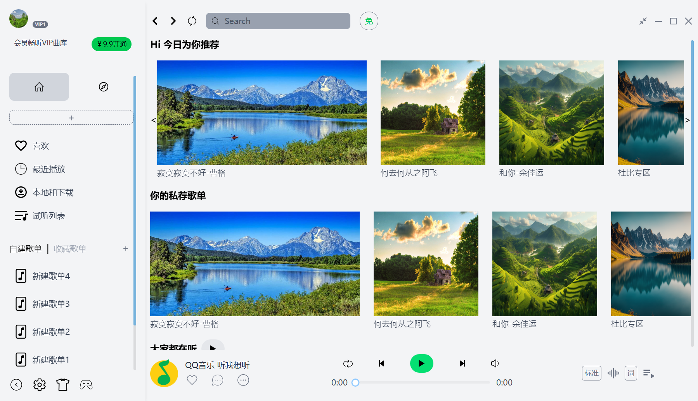

# QQ Music Clone

A desktop music player application inspired by QQ Music, built with Electron+React.

## Features

- Play local music
- Playlist management
- Modern, responsive UI

## Getting Started

### Prerequisites

- [Node.js](https://nodejs.org/)
- [npm](https://www.npmjs.com/) or [yarn](https://yarnpkg.com/)

### Installation

```bash
git clone https://github.com/victorbqcheng/qq-music-clone.git
cd qq-music-clone
npm install
```

### Running the App

```bash
npm start
```



## Project Structure

```
/src                # Source code
/src/main.ts        # Electron main process
/src/renderer.tsx    # Renderer process
```

## TODO:

- Tray
- Theme
- Desktop lyric
- log
- icon
- English
- Database, sqlite or mysql

## License

MIT

---

> This project is for learning and personal use only. Not affiliated with QQ Music or Tencent.
